# Wingman System Architecture

> Single source of truth for the entire Wingman trading system.
> Last updated: 2026-02-26

---

## Table of Contents

1. [System Overview](#system-overview)
2. [Architecture Diagram](#architecture-diagram)
3. [Component Inventory](#component-inventory)
4. [Data Flow](#data-flow)
5. [Cross-Scanner Integration](#cross-scanner-integration)
6. [API Gateway & Networking](#api-gateway--networking)
7. [Database Schema](#database-schema)
8. [Web Server & Dashboards](#web-server--dashboards)
9. [Scheduling & Cron](#scheduling--cron)
10. [Scripts & Analysis Tools](#scripts--analysis-tools)
11. [Dependency Map](#dependency-map)
12. [Port Allocation](#port-allocation)
13. [Configuration](#configuration)
14. [Status & Known Issues](#status--known-issues)
15. [File Structure](#file-structure)
16. [Operations Quick Reference](#operations-quick-reference)

---

## System Overview

Wingman is an autonomous opportunity detection system for options trading. It discovers symbols dynamically, scores confluence across multiple data sources (gamma levels, options flow, technicals, sector rotation, market internals), and alerts the trader via Telegram. **The system finds where to look; the trader makes all final decisions.**

**Key numbers:**
- 9 PM2 processes running concurrently
- 14 HTML dashboards
- 18+ SQLite tables in one database
- 3 external API dependencies
- 50+ symbols scanned per cycle
- 5-minute primary scan interval

---

## Architecture Diagram

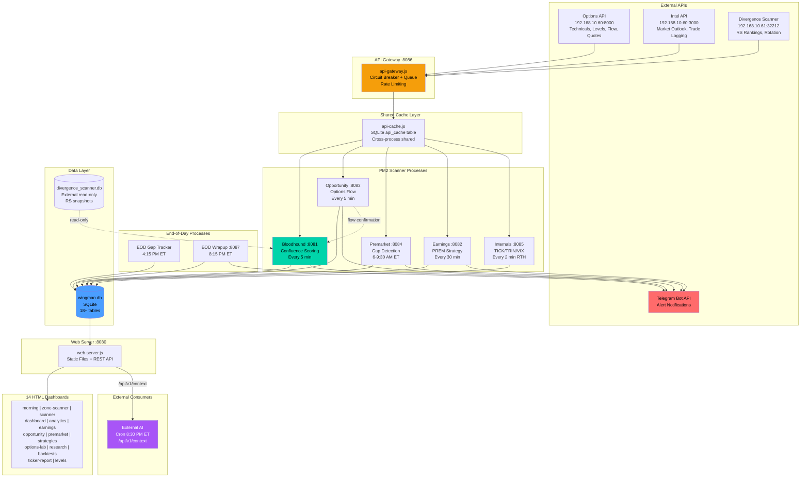

---

## Component Inventory

### PM2 Processes (9 total)

| Process | Port | File | Purpose | Scan Interval | Status |
|---------|------|------|---------|---------------|--------|
| **gateway** | 8086 | api-gateway.js | Central HTTP proxy, circuit breakers, rate limiting | Always-on | Working |
| **bloodhound** | 8081 | bloodhound-scanner.js | Core confluence scoring, zone classification, alerts | 5 min | Working |
| **opportunity** | 8083 | opportunity-scanner.js | Unusual options activity, vol/OI detection | 5 min | Working |
| **earnings** | 8082 | earnings-scanner.js | Pre-earnings momentum (PREM) strategy | 30 min | Working |
| **premarket** | 8084 | premarket-scanner.js | Gap detection (>=2%), 6-9:30 AM ET only | 5 min | Working |
| **internals** | 8085 | market-internals.js | TICK/TRIN/VIX/breadth collection, RTH only | 2 min | Working |
| **webserver** | 8080 | web-server.js | Static files + REST API for dashboards | Always-on | Working |
| **eod-tracker** | - | eod-gap-tracker.js | Gap outcome tracking at market close | Cron 4:15 PM ET | Working |
| **eod-wrapup** | 8087 | eod-wrapup.js | Daily Telegram summary + log archive | Cron 8:15 PM ET | Working |

### Shared Libraries

| File | Purpose | Used By |
|------|---------|---------|
| signal-db.js | Central SQLite data layer (40+ functions) | All scanners, web server, EOD processes |
| opportunity-db.js | Opportunity-specific SQLite operations | Opportunity scanner, Bloodhound, EOD wrapup |
| api-client.js | Shared fetchJSON (routes through gateway) | All scanners |
| api-cache.js | Cross-process SQLite cache (TTL-based) | All scanners via api-client |
| signal-logger.js | Signal validation + checkpoint tracking | Bloodhound, Earnings |
| telegram.js | Telegram message sending with retry | All scanners + EOD |
| config-loader.js | Config.json + env var loader | All modules |
| ma-bounce.js | MA bounce detection (per-ticker configs) | Bloodhound |
| divergence-bb.js | RSI divergence + Bollinger Band detection | Bloodhound |
| api-v1.js | External API v1 router (/api/v1/*) | Web server |

### Detection Modules (Backtest-Validated)

| Module | Technique | Scoring | Validated Symbols |
|--------|-----------|---------|-------------------|
| ma-bounce.js | Price bounce off MA (SMA/EMA/HMA) | +8 pts (if 65%+ WR) | SPY, QQQ, AAPL, NVDA, META, MSFT, TSLA, AMD |
| divergence-bb.js | RSI divergence at Bollinger Band extremes | +8-10 pts (if 65%+ WR) | 9 symbols, per-direction configs |

---

## Data Flow

### Primary Scan Data Flow

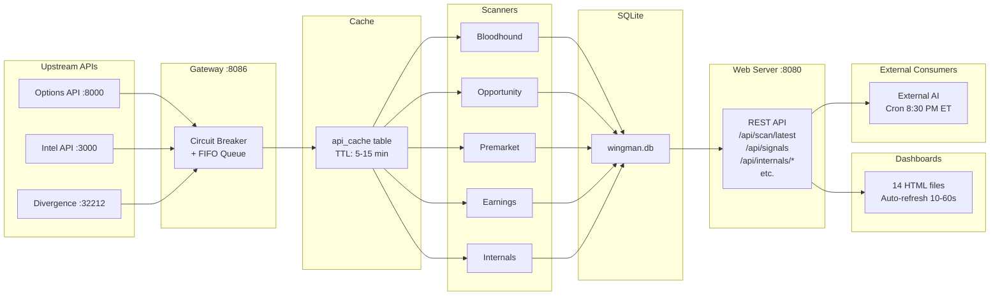

### Cross-Scanner Data Flow

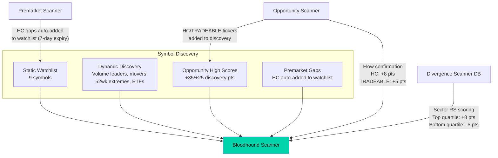

### Bloodhound Scan Cycle

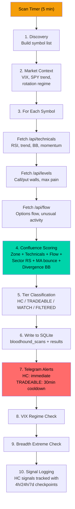

### EOD Data Collection

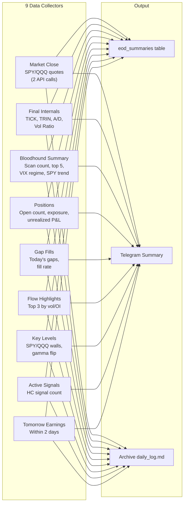

---

## Cross-Scanner Integration

### How Scanners Feed Each Other

```mermaid
flowchart TD
    subgraph Opportunity["Opportunity Scanner :8083"]
        OS["Scan options chains<br/>50 symbols every 5 min"]
        OD["Score vol/OI ratios,<br/>premium flow, positioning"]
        OT["Tier: HC (>=70) /<br/>TRADEABLE (50-69) /<br/>WATCH (30-49)"]
    end

    subgraph Premarket["Premarket Scanner :8084"]
        PS["Scan gaps >=2%<br/>6-9:30 AM ET"]
        PT["Tier: HUGE / LARGE /<br/>MODERATE"]
    end

    subgraph Divergence["Divergence Scanner (External)"]
        DS["RS rankings<br/>28 sector ETFs<br/>Every 30-45 min"]
    end

    subgraph Internals["Market Internals :8085"]
        IS["TICK, TRIN, A/D,<br/>Vol Ratio, VIX<br/>Every 2 min RTH"]
    end

    subgraph Bloodhound["Bloodhound Scanner :8081"]
        BD["Symbol Discovery"]
        BA["Confluence Analysis"]
        BS["Scoring Engine"]
        BT["Tier + Alert"]
    end

    OS --> OD --> OT
    OT -->|"HC/TRADEABLE symbols<br/>added to discovery pool<br/>+35/+25 discovery pts"| BD
    OT -->|"Flow confirmation scoring<br/>HC: +8 std pts<br/>TRADEABLE: +5 std pts"| BS

    PS --> PT
    PT -->|"HC gaps auto-added<br/>to watchlist<br/>7-day expiry"| BD

    DS -->|"Sector RS percentile<br/>Top quartile: +8 pts<br/>Above median: +4 pts<br/>Below median: -3 pts<br/>Bottom quartile: -5 pts"| BS

    IS -->|"Breadth state for<br/>extreme alerts<br/>Tiered annotations"| BA

    BD --> BA --> BS --> BT

    style Bloodhound fill:#0d2137,stroke:#00d4aa
    style Opportunity fill:#0d2137,stroke:#f59e0b
    style Premarket fill:#0d2137,stroke:#a855f7
    style Divergence fill:#0d2137,stroke:#4a9eff
    style Internals fill:#0d2137,stroke:#ff6b6b
```

### Confluence Scoring Breakdown

| Factor | Points | Source | Validation |
|--------|--------|--------|------------|
| Zone proximity (at wall) | Base | Gamma levels API | Zone classification |
| RSI extremes (<30 / >70) | Variable | Technicals API | Per-factor backtest |
| MA bounce | +8 | ma-bounce.js | Per-ticker 65%+ WR required |
| Divergence + BB | +8-10 | divergence-bb.js | Per-ticker, per-direction configs |
| Volume elevation (1.5x+) | Variable | Technicals API | Backtest validated |
| Sector RS (top quartile) | +8 | Divergence scanner DB | 72.7% 5d WR (n=22) |
| Sector RS (above median) | +4 | Divergence scanner DB | |
| Sector RS (below median) | -3 | Divergence scanner DB | |
| Sector RS (bottom quartile) | -5 | Divergence scanner DB | 47.2% 5d WR (n=36) |
| Opp flow confirmation (HC) | +8 | Opportunity scanner | Cross-scanner confluence |
| Opp flow confirmation (TRADEABLE) | +5 | Opportunity scanner | Cross-scanner confluence |
| Breadth alignment | Annotation | Market internals | Tiered (extreme/momentum/basic) |
| Counter-trend warning | Annotation | SPY trend vs signal | 55.6% vs 34.9% WR (counter wins) |

### Tradeable Tier Thresholds

| Tier | Criteria | Alert |
|------|----------|-------|
| **HIGH_CONVICTION** | AT_WALL + EXTENDED_RSI + score >=40, OR score >=60 at wall | Immediate Telegram |
| **TRADEABLE** | Score >=35 at wall + action | 30 min cooldown |
| **WATCH** | Score >=20 near wall, OR EXTENDED_LOW + oversold, OR MID_RANGE/PINNED + score >=35 | Dashboard only |
| **FILTERED** | Everything else | Dashboard only |

---

## API Gateway & Networking

### Gateway Architecture

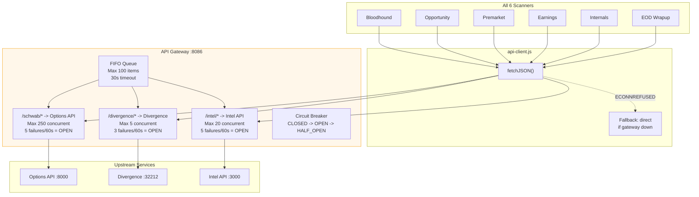

### API Cache TTL Rules

| Endpoint Pattern | TTL | Constant | Rationale |
|------------------|-----|----------|-----------|
| `/api/technicals/*` | 15 min | `TTL.TECHNICALS` | Slow-changing indicators |
| `/api/flow/*` | 15 min | `TTL.FLOW` | Flow aggregates stable |
| `/api/options/*/analysis` | 10 min | `TTL.ANALYSIS` | Options analysis |
| `/api/options/*/iv` | 10 min | `TTL.IV` | IV percentile |
| `/api/market/context` | 5 min | `TTL.CONTEXT` | Market regime changes faster |
| `/api/calendar/*` | 24 hours | `TTL.CALENDAR` | Earnings dates rarely change |
| `/api/levels/*` | **NEVER** | - | Real-time gamma walls |
| `/api/quotes/*` | **NEVER** | - | Real-time prices |

### Scan Staggering

```mermaid
gantt
    title Scanner Start Offsets (avoids API rate limit of 300 concurrent)
    dateFormat ss
    axisFormat %S s

    section Scanners
    Bloodhound (populates cache)     :bh, 00, 10s
    Premarket (if 6-9:30 AM)         :pm, 60, 10s
    Opportunity (reads warm cache)   :op, 90, 30s
    Earnings (everything cached)     :ea, 180, 10s
```

| Scanner | Offset | Rationale |
|---------|--------|-----------|
| Bloodhound | 0s | Fires first, populates cache for all others |
| Premarket | 60s | Only 6-9:30 AM, light overlap |
| Opportunity | 90s | Reads warm cache from Bloodhound |
| Earnings | 180s | Everything cached, near-zero upstream load |

---

## Database Schema

### Entity Relationship Overview

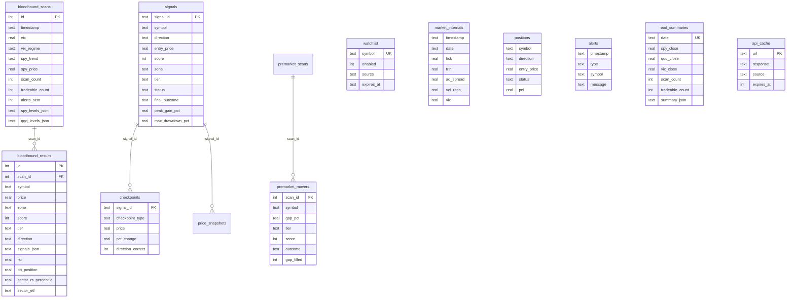

### All Tables

| Table | Purpose | Written By | Key Columns |
|-------|---------|------------|-------------|
| **bloodhound_scans** | Scan metadata per cycle | Bloodhound | timestamp, vix, vix_regime, spy_trend, scan_count |
| **bloodhound_results** | Per-ticker results per scan | Bloodhound | symbol, zone, score, tier, direction, signals_json, sector_rs_percentile |
| **scanner_history** | Day 2/Streak badge tracking | Bloodhound | symbol, date, peak_score, peak_zone, consecutive_days |
| **signals** | Signal lifecycle tracking | Bloodhound, Earnings | signal_id, symbol, entry_price, status, peak_gain_pct, max_drawdown_pct |
| **checkpoints** | Multi-checkpoint validation | Signal logger | signal_id, checkpoint_type (4h/24h/7d), pct_change |
| **price_snapshots** | Detailed price history per signal | Signal logger | signal_id, timestamp, price, pct_change |
| **scans** (opportunity) | Opportunity scan metadata | Opportunity | timestamp, symbols_scanned, tier counts |
| **opportunities** | Unusual options activity records | Opportunity | symbol, tier, score, vol_oi_ratio, net_premium, direction |
| **earnings_scans** | Earnings scan metadata | Earnings | timestamp, strategy, total_scanned |
| **earnings_results** | PREM candidates | Earnings | symbol, earnings_date, score, direction, iv_rank |
| **earnings_calendar** | Earnings dates | Earnings scraper | symbol, earnings_date, earnings_time |
| **premarket_scans** | Premarket scan metadata | Premarket | timestamp, market_open, es_price, market_bias |
| **premarket_movers** | Gap movers | Premarket + EOD tracker | symbol, gap_pct, tier, score, gap_filled, outcome |
| **gap_ticker_stats** | Per-ticker gap analytics | EOD tracker | symbol, total_gaps, fill_rate, win_rate |
| **market_internals** | Breadth/VIX readings (2-min RTH) | Internals | timestamp, tick, trin, ad_spread, vol_ratio, vix |
| **watchlist** | Static + dynamic symbols | Premarket, manual | symbol, enabled, source, expires_at |
| **positions** | Open/closed trades | Manual/API | symbol, direction, entry_price, status, pnl |
| **alerts** | Telegram alert history | All scanners | timestamp, type, symbol, message |
| **analyses** | Research journal entries | Manual/API | symbol, verdict, bull/bear_factors_json |
| **eod_summaries** | Daily wrap-up data | EOD wrapup | date, spy_close, vix_close, scan_count, summary_json |
| **api_cache** | Cross-process API cache | All scanners | url, response, source, expires_at |
| **ma_backtest_results** | MA backtest sweep results | ma-backtest.js | symbol, mode, ma_type, fast, slow, win_rate |
| **divergence_bb_results** | Divergence BB backtest results | divergence-bb-backtest.js | symbol, variant, lookback, win_rate |

---

## Web Server & Dashboards

### API Endpoint Map

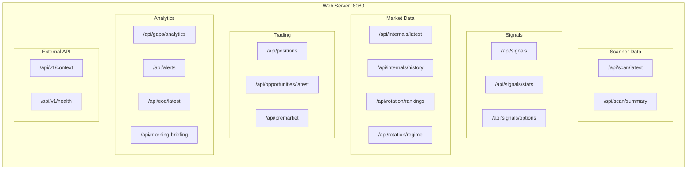

### Dashboard Inventory

| Dashboard | File | Data Source | Refresh | Key Features |
|-----------|------|------------|---------|--------------|
| **Morning Briefing** | morning.html | /api/morning-briefing | 60s | Gaps, market context, pre-market summary |
| **Zone Scanner** | zone-scanner.html | /api/scan/latest, /api/internals/latest | 30s | Ticker cards, zone badges, confluence scores, internals bar |
| **Market Dashboard** | scanner.html | /api/internals/*, /api/scan/summary | 30s | 4 Chart.js charts (TICK/TRIN/Vol/VIX), threshold lines |
| **Trading Dashboard** | dashboard.html | /api/positions | 10s | P&L tracking, position management, risk bars |
| **Analytics** | analytics.html | /api/signals, /api/signals/stats | 30s | Signal validation by tier, VIX regime, score range |
| **Earnings** | earnings-scanner.html | Earnings scanner API :8082 | 30s | PREM candidates, earnings calendar |
| **Opportunity** | opportunity-scanner.html | /api/opportunities/latest | 30s | Vol/OI ratios, net premium, flow direction |
| **Pre-Market** | premarket.html | /api/premarket, /api/gaps/* | 60s | Gap tiers (HUGE/LARGE/MODERATE), fill analytics |
| **Strategies** | strategies.html | Static | None | 10 strategy cards, automation badges, P1/P2 candidates |
| **Options Lab** | options-lab.html | Options API proxy | Manual | Greeks, vol surface, strike analysis |
| **Research** | research.html | /api/analyses | Manual | Analysis journal, hypothesis tracking |
| **Backtests** | backtests.html | /api/backtest/results | Manual | MA backtest results by symbol/mode |
| **Ticker Report** | ticker-report.html | Multiple APIs | Manual | Single-ticker deep dive |
| **Levels** | levels.html | Options API proxy | Manual | Gamma walls, max pain, expected move |

### Navigation Structure

All dashboards share `css/nav.css`:
- **Main nav:** Morning | Zones | Gaps | Earnings | Flow | Market
- **INSIGHTS dropdown:** Analytics | Research | Strategies | Options Lab | Backtests | Ticker Report | Levels | Dashboard

### Design System

| Element | Value |
|---------|-------|
| Background | `#0a0e1a` (dark navy) |
| Card | `#151821` (lighter navy) |
| Border | `#2a3641` (muted blue-gray) |
| Text | `#e5e7eb` (light gray) |
| Accent | `#00d4aa` (teal) |
| Positive | `#00d4aa` (teal) |
| Negative | `#ff6b6b` (red) |
| Warning | `#ffc107` (amber) |
| Font | -apple-system, BlinkMacSystemFont, 'Segoe UI', Roboto |

---

## Scheduling & Cron

### Daily Timeline

```mermaid
gantt
    title Wingman Daily Schedule (ET)
    dateFormat HH:mm
    axisFormat %H:%M

    section Pre-Market
    Premarket Scanner (gaps >=2%)    :active, pm, 06:00, 09:30

    section Regular Trading Hours
    Market Internals (2-min cycle)   :active, mi, 09:30, 16:00
    Bloodhound (5-min cycle)         :active, bh, 09:30, 16:00
    Opportunity (5-min cycle)        :active, op, 09:30, 16:00
    Earnings (30-min cycle)          :active, ea, 09:30, 16:00

    section Post-Market
    EOD Gap Tracker                  :crit, gt, 16:15, 16:30
    EOD Wrapup + Telegram            :crit, ew, 20:15, 20:45
    External AI Consumer             :done, ai, 20:30, 20:35

    section Always Running
    API Gateway                      :done, gw, 00:00, 23:59
    Web Server                       :done, ws, 00:00, 23:59
```

### Cron Jobs

| Schedule | Script | Purpose |
|----------|--------|---------|
| Every hour | scripts/archive-logs.sh | Copy PM2 logs to repo, git commit + push |
| Sunday midnight | scripts/flush-logs.sh | Archive then flush PM2 logs |
| 4:15 PM ET M-F | eod-gap-tracker.js (node-cron) | Capture gap fill outcomes |
| 4:30 PM ET M-F | eod-gap-tracker.js (backup) | Backup gap tracking |
| 8:15 PM ET M-F | eod-wrapup.js (node-cron) | Daily Telegram summary |
| 8:30 PM ET M-F | eod-wrapup.js (backup) | Backup summary |
| Midnight ET daily | opportunity-scanner.js | Reset persistence tracking |

---

## Scripts & Analysis Tools

### Backtesting & Audit Scripts

| Script | Purpose | Usage | Status |
|--------|---------|-------|--------|
| **ma-backtest.js** | MA alignment/crossover/bounce backtester | `node scripts/ma-backtest.js alignment --symbol SPY --sweep --save` | Active |
| **divergence-bb-backtest.js** | RSI divergence + Bollinger Band backtester | `node scripts/divergence-bb-backtest.js --symbol ALL --sweep --save` | Active |
| **audit-build-returns.js** | Build forward returns dataset (prerequisite) | `node scripts/audit-build-returns.js --fresh` | Active |
| **audit-factor-analysis.js** | Factor win rate analysis (60+ factors) | `node scripts/audit-factor-analysis.js` | Active |
| **audit-flow-analysis.js** | Options flow effectiveness analysis | `node scripts/audit-flow-analysis.js --symbol TSLA` | Active |
| **audit-flow-sector-analysis.js** | Flow x sector RS interaction | `node scripts/audit-flow-sector-analysis.js` | Active |
| **enrich-signals-ma.js** | Enrich signals with MA alignment data | `node scripts/enrich-signals-ma.js --save` | Active |
| **ticker-report.js** | Per-symbol backtest report | `node scripts/ticker-report.js NVDA --run` | Active |

### Shared Library

| File | Purpose |
|------|---------|
| scripts/lib/audit-utils.js | Shared functions: DB access, history fetch, forward returns, factor extraction (60+ FACTOR_MAP entries), win rate calculation |

### Shell Scripts

| Script | Schedule | Purpose |
|--------|----------|---------|
| scripts/archive-logs.sh | Hourly cron | Archive PM2 logs to git repo |
| scripts/flush-logs.sh | Weekly Sunday | Archive + flush PM2 logs |
| scripts/revert-gateway.sh | Manual | Emergency gateway rollback |

### Utility Scripts

| Script | Purpose | Status |
|--------|---------|--------|
| monitor/watchlist.js | Watchlist CLI (list/add/remove/enable/disable) | Active |
| monitor/scanner-validator.js | Validate scanner ticker coverage | Active |
| monitor/trade-client.js | Trade logging CLI for Intel API | Active |
| monitor/earnings-calendar-scraper.js | Fetch earnings dates to DB | Active |
| monitor/cleanup-duplicate-signals.js | One-time signal dedup | Historical |
| monitor/migrate-to-db.js | JSON to SQLite migration | Historical |
| monitor/migrate-watchlist.js | Watchlist JSON to SQLite | Historical |

### Deprecated

| File | Replacement |
|------|-------------|
| eod.js | monitor/eod-wrapup.js |
| monitor/wingman-monitor.js | VIX alerts built into bloodhound-scanner.js |
| monitor/_legacy/zone-scanner.js | Current zone-scanner.html |
| scripts/divergence-analysis.js (v1-v3) | scripts/divergence-bb-backtest.js |
| scripts/ad_backtest.js | scripts/internals_backtest.js |

---

## Dependency Map

### External Dependencies

```mermaid
flowchart TD
    subgraph External["External Services (not controlled by us)"]
        OA["Options API<br/>192.168.10.60:8000<br/>Schwab data wrapper"]
        IA["Intel API<br/>192.168.10.60:3000<br/>Market intel + trade logging"]
        DS["Divergence Scanner<br/>192.168.10.61:32212<br/>Sector RS + rotation"]
        TG["Telegram Bot API<br/>Alert delivery"]
    end

    subgraph Internal["Wingman System"]
        GW["Gateway :8086"]
        BH["Bloodhound"]
        OPP["Opportunity"]
        PM["Premarket"]
        EA["Earnings"]
        MI["Internals"]
        WS["Web Server"]
        EOD["EOD Processes"]
    end

    OA -->|"technicals, levels,<br/>flow, quotes, calendar"| GW
    IA -->|"market outlook,<br/>trade history"| GW
    DS -->|"RS rankings,<br/>rotation regime"| GW
    DS -->|"RS snapshots<br/>(direct DB read)"| BH

    GW --> BH & OPP & PM & EA & MI & EOD
    BH & OPP & PM & EA & EOD -->|"alerts"| TG

    style External fill:#2a0a0a,stroke:#ff6b6b
    style Internal fill:#0a1a2a,stroke:#00d4aa
```

### NPM Dependencies

| Package | Purpose |
|---------|---------|
| better-sqlite3 | SQLite database access |
| node-cron | Cron scheduling (EOD processes) |
| axios | HTTP client (signal-logger) |

### CDN Dependencies (Dashboards)

| Library | Version | Used By |
|---------|---------|---------|
| Chart.js | 4.4.0-4.4.4 | scanner.html, research.html, options-lab.html, levels.html |

---

## Port Allocation

| Port | Service | Type | File |
|------|---------|------|------|
| **3000** | Intel API | External | Remote server |
| **8000** | Options API | External | Remote server |
| **8080** | Web Server | HTTP + API | web-server.js |
| **8081** | Bloodhound Control | Scanner API | bloodhound-scanner.js |
| **8082** | Earnings Control | Scanner API | earnings-scanner.js |
| **8083** | Opportunity Control | Scanner API | opportunity-scanner.js |
| **8084** | Premarket Control | Scanner API | premarket-scanner.js |
| **8085** | Internals | Scanner API | market-internals.js |
| **8086** | API Gateway | HTTP Proxy | api-gateway.js |
| **8087** | EOD Wrapup | Control API | eod-wrapup.js |
| **32212** | Divergence Scanner | External | Remote server (192.168.10.61) |

---

## Configuration

### Config Files

| File | Purpose |
|------|---------|
| `ecosystem.config.js` | PM2 process definitions (9 processes, memory limits, stagger offsets) |
| `monitor/config.json` | API endpoints, Telegram credentials, port assignments |
| `monitor/config-loader.js` | Loads config.json + env var overrides |
| `.env` (optional) | Environment variable overrides |
| `package.json` | Node.js dependencies |
| `CLAUDE.md` | AI assistant instructions (comprehensive system guide) |

### Environment Variables

| Variable | Default | Purpose |
|----------|---------|---------|
| `OPTIONS_API` | `http://192.168.10.60:8000` | Options API endpoint |
| `INTEL_API` | `http://192.168.10.60:3000` | Intel API endpoint |
| `DIVERGENCE_API` | null (DB read) | Divergence scanner endpoint |
| `SCAN_OFFSET_MS` | Per-process | Stagger offset for scan timing |
| `TELEGRAM_BOT_TOKEN` | From config.json | Telegram bot token |
| `TELEGRAM_CHAT_ID` | From config.json | Telegram chat ID |

---

## Status & Known Issues

See [KNOWN_ISSUES.md](KNOWN_ISSUES.md) for the full list.

### System Health Summary

| Component | Status | Notes |
|-----------|--------|-------|
| Bloodhound Scanner | **Working** | Core system, all features operational |
| Opportunity Scanner | **Working** | Aborts scan on market context API failure (fragile) |
| Premarket Scanner | **Working** | Only runs 6-9:30 AM ET |
| Earnings Scanner | **Working** | 30-min cycle, lower priority |
| Market Internals | **Working** | tick_high/tick_low always 0 (Schwab limitation) |
| API Gateway | **Working** | Circuit breaker + queue functional |
| Web Server | **Working** | All 14 dashboards serving |
| EOD Gap Tracker | **Working** | Daily cron at 4:15 PM ET |
| EOD Wrapup | **Working** | Daily cron at 8:15 PM ET |
| Signal Validation | **Partial** | 7-day checkpoints not executing (0/187) |
| SPY/QQQ change_pct | **Incomplete** | Hardcoded to 0 in scan output |

### Open Issues (Priority Order)

| # | Severity | Issue | File |
|---|----------|-------|------|
| 1 | HIGH | Opportunity scanner aborts entire scan on market context API failure | opportunity-scanner.js |
| 2 | HIGH | 7-day signal checkpoints not executing (0/187 eligible) | signal-logger.js |
| 3 | MEDIUM | SPY/QQQ change_pct hardcoded to 0 | bloodhound-scanner.js:2909 |
| 4 | MEDIUM | Silent error catch (empty catch block) | bloodhound-scanner.js:2140 |
| 5 | MEDIUM | Relative path to external divergence DB (fragile) | bloodhound-scanner.js:832 |
| 6 | MEDIUM | tick_high/tick_low always 0 in market_internals | market-internals.js |
| 7 | LOW | Legacy eod.js still exists (deprecated) | eod.js |
| 8 | LOW | _legacy/ folder should be deleted | monitor/_legacy/ |
| 9 | LOW | JSON files still in data/ (migration mandate) | data/*.json |
| 10 | LOW | Hourly log commits inflating .git history | scripts/archive-logs.sh |

### JSON Elimination Status

Per project mandate: ALL data must live in SQLite. Remaining JSON files:

| File | Status | Blocker |
|------|--------|---------|
| account_summary.json | Orphaned (stale since Dec 2025) | Written by deprecated eod.js |
| paper_trades.json | Empty (18 bytes) | Referenced in web-server.js |
| spy_history.json | Research only | Used by legacy backtest scripts |
| vix_history.json | Research only | Used by legacy backtest scripts |
| add_history.json | Research only | Used by legacy backtest scripts |
| data/history/*.json | Active cache | MA bounce 24h file cache (acceptable) |

---

## File Structure

```
wingman/
├── CLAUDE.md                      # AI instructions (comprehensive)
├── README.md                      # Project overview
├── package.json                   # Node.js dependencies
├── ecosystem.config.js            # PM2 process config (9 services)
├── eod.js                         # DEPRECATED (use eod-wrapup.js)
│
├── morning.html                   # Default dashboard
├── zone-scanner.html              # Bloodhound zones + scores
├── scanner.html                   # Market internals charts
├── dashboard.html                 # P&L + positions
├── analytics.html                 # Signal validation
├── earnings-scanner.html          # Earnings PREM
├── opportunity-scanner.html       # Options flow
├── premarket.html                 # Gap detection
├── strategies.html                # Strategy browser
├── options-lab.html               # Options analysis
├── research.html                  # Research journal
├── backtests.html                 # MA backtest results
├── ticker-report.html             # Single-ticker analysis
├── levels.html                    # Gamma levels
│
├── css/
│   └── nav.css                    # Shared navigation styles
│
├── monitor/
│   ├── config.json                # API + Telegram config
│   ├── config-loader.js           # Config loader
│   │
│   ├── api-gateway.js             # Central HTTP proxy :8086
│   ├── api-client.js              # Shared fetch module
│   ├── api-cache.js               # Cross-process SQLite cache
│   ├── api-v1.js                  # External API v1
│   │
│   ├── bloodhound-scanner.js      # PRIMARY SCANNER :8081
│   ├── opportunity-scanner.js     # Options flow :8083
│   ├── earnings-scanner.js        # Earnings PREM :8082
│   ├── premarket-scanner.js       # Gap detection :8084
│   ├── market-internals.js        # Breadth collector :8085
│   │
│   ├── web-server.js              # Dashboard server :8080
│   ├── eod-gap-tracker.js         # Gap outcomes (cron)
│   ├── eod-wrapup.js              # Daily summary :8087
│   │
│   ├── signal-db.js               # SQLite data layer
│   ├── signal-logger.js           # Signal validation
│   ├── opportunity-db.js          # Opportunity DB
│   ├── telegram.js                # Telegram messaging
│   │
│   ├── ma-bounce.js               # MA bounce detection
│   ├── divergence-bb.js           # Divergence + BB detection
│   │
│   ├── watchlist.js               # Watchlist CLI
│   ├── scanner-validator.js       # Validation tool
│   ├── trade-client.js            # Trade logging client
│   ├── earnings-calendar-scraper.js # Earnings scraper
│   └── _legacy/                   # Deprecated code
│
├── scripts/
│   ├── ma-backtest.js             # MA backtester
│   ├── divergence-bb-backtest.js  # Divergence BB backtester
│   ├── audit-build-returns.js     # Forward returns builder
│   ├── audit-factor-analysis.js   # Factor analysis
│   ├── audit-flow-analysis.js     # Flow analysis
│   ├── audit-flow-sector-analysis.js # Flow x sector
│   ├── enrich-signals-ma.js       # MA enrichment
│   ├── ticker-report.js           # Per-symbol report
│   ├── lib/
│   │   └── audit-utils.js         # Shared audit library
│   ├── archive-logs.sh            # Hourly log archive
│   ├── flush-logs.sh              # Weekly log flush
│   └── revert-gateway.sh          # Emergency rollback
│
├── data/
│   ├── wingman.db                 # PRIMARY SQLite database
│   ├── MARKET_INTEL.md            # Living market intelligence + session checkpoint
│   ├── daily_log.md               # Trading journal
│   ├── STRATEGY_CANDIDATES.md     # Strategy research
│   ├── history/                   # OHLCV cache files
│   └── archive/                   # Archived logs + deprecated
│
├── docs/
│   ├── SYSTEM_ARCHITECTURE.md     # This file
│   ├── KNOWN_ISSUES.md            # Issue tracker
│   ├── VISION.md                  # Project philosophy
│   ├── RULES.md                   # Trading rules
│   ├── STRATEGIES.md              # Trading strategies
│   ├── API_V1.md                  # External API docs
│   └── [changelogs, plans, audits]
│
├── .claude/
│   ├── commands/                  # /kungfu, /checkpoint, /pulse, /note
│   └── memory/                    # Persistent AI memory
│
├── backtesting/                   # JS/Python/Pine backtesting
├── indicators/                    # TradingView Pine indicators
└── logs/pm2/                      # Archived PM2 logs
```

---

## Operations Quick Reference

### Start/Stop

```bash
pm2 start ecosystem.config.js          # Start all 9 processes
pm2 list                                # Show process status
pm2 logs [name]                         # Tail logs
pm2 restart all                         # Restart (keeps env vars)
pm2 delete all && pm2 start ecosystem.config.js  # Full restart (re-reads env vars)
```

### Health Checks

```bash
curl localhost:8080/api/scan/summary    # Bloodhound status
curl localhost:8086/status              # Gateway status (circuit breakers)
curl localhost:8080/api/cache/stats     # Cache efficiency
curl localhost:8080/api/internals/latest # Current market breadth
curl localhost:8080/api/v1/health       # Full system health
```

### Manual Triggers

```bash
node monitor/eod-wrapup.js --now        # Force EOD summary
node monitor/eod-gap-tracker.js --now   # Force gap tracking
curl localhost:8081/scan                # Force Bloodhound scan
curl localhost:8083/scan                # Force Opportunity scan
```

### Backtest Workflow

```bash
# Step 1: Build forward returns dataset
node scripts/audit-build-returns.js --fresh

# Step 2: Run analysis
node scripts/audit-factor-analysis.js
node scripts/audit-flow-analysis.js
node scripts/audit-flow-sector-analysis.js

# Step 3: MA backtesting
node scripts/ma-backtest.js alignment --symbol ALL --sweep --save
node scripts/ma-backtest.js crossover --symbol ALL --sweep --save

# Step 4: Per-symbol report
node scripts/ticker-report.js NVDA --run
```
